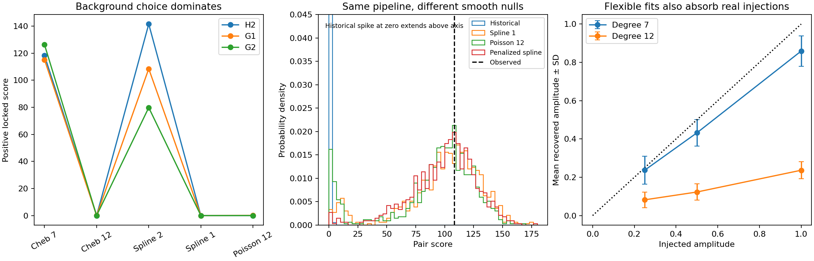
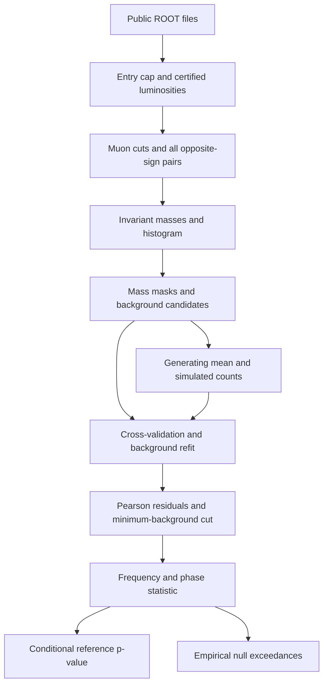

# Independent adversarial audit of the WCT CMS analysis

**Determination: C. Suggestive only / insufficiently robust.**

The fixed-frequency residual is reproducible, including on the prospectively phase-locked second Run2016G file. Its quoted significance is not robust to background uncertainty. Smooth generating models with no explicitly injected sinusoid produce a score at least as large as observed in **359–442 of 1,000 trials**, with the original background-selection, fitting, and scoring pipeline rerun in every trial. This is a concrete failure of a model-robust significance interpretation, not proof that the physical spectrum contains no periodic component.

Audit date: 2026-09-07. Historical source: `rickyjreyes/wct-cms`, `main` commit `1c580e141eb5be65b81b0ca638da25bc69d2f0cc`. Audit branch: `agent/cms-independent-adversarial-audit`. Historical source, acceptance rules, and results are preserved. The preceding PDE closure investigation is outside this audit.



## 1. Reproduction and evidence status

Run from the repository root in a clean Python 3.12 environment:

```bash
python -m pip install -r experiments/cms_audit/requirements.txt
python -m pip install -e '.[dev]'
python experiments/cms_audit/fetch_inputs.py
OPENBLAS_NUM_THREADS=1 python experiments/cms_audit/reproduce_initial.py
OPENBLAS_NUM_THREADS=1 python experiments/cms_audit/run_spectrum_attacks.py
OPENBLAS_NUM_THREADS=1 python experiments/cms_audit/run_failure_certificate.py --out results/cms_audit_certificate_clean
OPENBLAS_NUM_THREADS=1 python experiments/cms_audit/run_additional_controls.py
OPENBLAS_NUM_THREADS=1 python experiments/cms_audit/run_model_averaging.py
OPENBLAS_NUM_THREADS=1 python experiments/cms_audit/run_event_controls.py
python -m pytest -q
python experiments/cms_audit/plot_audit.py
```

The baseline wrapper writes `results/cms_audit_clean`; compare its spectra and summaries with `audit/2026-09-06/baseline`. Subsequent attacks intentionally read the archived baseline, providing a second reproduction route that does not require downloading multi-GB ROOT files. The certificate's new output directory forces a clean run rather than resuming archived checkpoints. Other experimental scripts regenerate their audit output files; they do not alter historical reference results. Download checks use public file sizes and Adler-32 values. Four full ROOT files are needed for event-level controls; archived extracted masses suffice for the unbinned checks.

The completed computation includes baseline spectra and masses, background/selection sweeps, **18,000 pair-pipeline trials**, and **4,800 injection/control fit rows**. Git retains the compact certificate `manifest.json` and `summary.json`, baseline/attack outputs, recovery/control tables, the seeded failure-witness regression, and all scripts needed to regenerate the per-chunk trial outputs. The individual certificate checkpoint JSONs are intentionally not versioned. The original 29 tests passed before changes; all **35 tests** pass with six audit regressions added. Numerical seeds and case counts are in `certificate/manifest.json` and the scripts. Package versions are pinned in `experiments/cms_audit/requirements.txt`.

**Archive limitation:** a workspace rollback during continuation removed a prior event-control pass's full ROOT downloads and detailed event CSVs. Its actual observed summaries are explicitly marked as prior-pass observations in `prior_pass_event_observations.json`; the event reproduction script has been restored, but those event checks have not been rerun after the rollback. Do not treat that summary as a freshly verified raw-data archive. The baseline, background attacks, and regenerated certificate underlying the principal conclusion are retained. The baseline/background checkpoint is also preserved in commit `521f9252012fdcc84dd164ee818c34230e6b84e9`.

## 2. Baseline result

| Dataset | Certified events / first 100,000 entries | In-range opposite-sign pairs | Reproduced statistic | Historical statistic |
|---|---:|---:|---:|---:|
| H1 discovery file | 50,951 | 21,930 | 75.76117, free phase at selected frequency | 75.76163 |
| H2 replication file | 90,868 | 39,230 | 118.94120, free phase at frozen frequency | 118.91483 |
| G1 replication file | 100,000 | 39,633 | 115.88074, free phase at frozen frequency | 115.89210 |
| G2 phase-locked file | 100,000 | 38,917 | 126.27500, positive locked amplitude | 126.28324 |
| H2/G1 selected-background pair | — | — | **108.43746** | **108.49776** |

This is close numerical reproduction, not bitwise identity. The pair discrepancy is about 0.056%; historical dependency locks and complete intermediate artifacts do not establish its cause. The observed pair winner remains `spline_s2`. The regenerated 10,000-trial historical null has zero exceedances and a 95th-percentile score of 0.86778746. Baseline 1,000 permutations and 500 parametric refits also have zero exceedances in their archived outputs.

The reconstructed analytic local p-values include H2 `1.4868e-26`, G1 `6.8678e-26`, and G2 locked `1.3385e-29`. These are conditional reference-distribution calculations, **not validated physical discovery probabilities**. Zero exceedances in 10,000 trials cannot resolve such tails.

## 3. Data, transformations, selections, and dependency graph

Sources are public CMS NanoAOD DoubleMuon data: [Run2016H record 30555](https://opendata.cern.ch/record/30555) and [Run2016G record 30522](https://opendata.cern.ch/record/30522). Their complete metadata are archived as `baseline/cms30555.json` and `cms30522.json`.

| Label | ROOT file |
|---|---|
| H1 | `127C2975-1B1C-A046-AABF-62B77E757A86.root` |
| H2 | `183BFB78-7B5E-734F-BBF5-174A73020F89.root` |
| G1 | `05DD095C-F6C3-9A4F-9FB3-348A5A6403D5.root` |
| G2 | `209D94D9-B6D5-A34B-A2A3-CBB7E4EA8ADF.root` |

Only the first 100,000 entries of each file are used, with the cap applied **before** luminosity certification. Thus this is neither the full public sample nor a random luminosity-weighted sample. Certification uses the committed MuonPhys JSON for runs 271036–284044. Muons require transverse momentum at least 4 GeV, absolute pseudorapidity at most 2.4, and tight identification. All qualifying opposite-charge pairs are retained; multiple pairs can share an event or muon.

Mass is the invariant mass from the two reconstructed four-vectors, with negative numerical mass-squared clipped to zero before the square root. There is no efficiency unfolding, luminosity normalization, explicit trigger-object matching, isolation cut, or vertex-quality requirement in the nominal analysis. The [CMS trigger guide](https://opendata.cern.ch/docs/cms-guide-trigger-system) explains why a data-stream selection alone does not supply a uniform acceptance model.

Counts use 350 geometrically spaced bins over 2–120 GeV. Bin-center masks exclude 2.9–3.3, 3.55–3.85, 8.5–11.5, and 80–100 GeV; 287 centers remain before model-dependent minimum-background exclusions. The original fit works in log mass and log(count + 0.5), excludes zero-count bins, uses square-root count weights, and iteratively clips at 3.5 for up to six iterations. Its nominal degree is seven. Residuals are Pearson-like `(count-background)/sqrt(max(background,1))`; scoring additionally requires fitted background at least five. This fitting and selection induces dependence between residuals.



The simulation loop includes the original 15-model selector, refitting, adaptive residual eligibility, and pair statistic. It does not reconstruct unknown human decisions preceding the freeze.

## 4. Frozen parameters and selection history

The repository history supports the following sequence; commit chronology cannot certify that no unrecorded data inspection occurred.

- Initial broad H1 exploration over frequency 0.5–80, without the eventual masking, produced a low-frequency boundary maximum. Masking and a 3.1 lower frequency bound were adopted after inspection.
- The H1 candidate frequency `7.025825825825827` was frozen in `afa8790`, before H2 result `eeab1a0` and the G1 freeze/result (`2de48dc` / `dd475d7`). The frequency came from a search; it was not a unique numerical prediction derived independently from WCT.
- The locked phase `-0.2313916852932179` was obtained from H2 and G1 phases. It is retrospective for that pair. Coherence rules and the background cross-validation protocol were also developed after observing those spectra.
- G2 phase-lock freezes `685553b` / `3e7a9f1` precede result `97e1135`. This is a meaningful prospective file holdout. It is another G file, not a third run period. A proposed F target was replaced with G2.

The frequency grid, phase freedom, masks, range, background families, cross-validation layout, pair aggregation, and coherence requirements are analysis choices. For a retrospective discovery claim their actual selection must be represented in the null or an independent holdout. Conversely, a genuinely frozen G2 test does not automatically owe the full H1 frequency-search penalty. Replacing log mass with log mass-squared merely rescales frequency; changing the reference mass shifts phase. Neither transformation supplies independent confirmation.

## 5. Exact statistic and minimal statistical obstruction

For centered residual vector `r` and centered locked template `g = cos(omega log(m/1 GeV) - phase)`, the fitted signed amplitude and positive-component score are

\[
\widehat A=\frac{g^T r}{g^Tg},\qquad
Q=\frac{[\max(0,g^Tr)]^2}{g^Tg}.
\]

The free-phase variant fits sine and cosine plus an intercept and reports the decrease in unweighted residual sum of squares. The primary pair score is the minimum of the two positive locked scores after selection of a common background family. It is a delta-chi-square-type statistic, not automatically a calibrated likelihood ratio for the event data.

With fixed template and known independent unit Gaussian residuals, the positive locked score has the familiar half-point-mass/half-chi-square-one reference. Under background error `E[r]=d` and covariance `C`, however, `E[g^T r]=g^T d` and `Var(g^T r)=g^T Cg`. The historical denominator does not account for either quantity. Adaptive background selection, clipping, shared-event pairs, and template selection add further complications. See [Cowan et al.](https://arxiv.org/abs/1007.1727) for the assumptions behind asymptotic likelihood references.

**Minimal obstruction:** the generating background is not independently identified tightly enough to separate its smooth error along the candidate template from a signal. On a finite positive mass interval, a positive mean `B + A sqrt(B) cos(omega log m - phase)` is itself smooth. An unrestricted positive smooth-background null therefore overlaps the proposed signal family. Smoothness alone cannot identify the decomposition. This mathematical non-identifiability is distinct from the numerical finding that specific defensible smooth alternatives defeat the present significance calibration.

A phase-selection regression illustrates the issue without claiming an exact correction for the CMS pair: selecting phase from two Gaussian harmonic coordinates changes a fixed positive-component tail into a two-coordinate tail. A nominal 0.001 fixed-phase threshold then has exceedance probability about 0.00844.

## 6. Background-model attacks

The audit adds unpenalized Poisson log-polynomials of degrees 2, 3, 5, 7, 9, 12, 16, and 20; cubic penalized splines with 8/16/24/40 internal knots and four penalties; a CMS dijet-style empirical form; and local quadratic log-density smoothers at three bandwidths. Penalized splines supply the comparable smooth nonparametric alternative; no Gaussian-process result is claimed. The dijet form is a sensitivity model, not a validated physical prediction for inclusive low-mass dimuons.

Poisson alternatives retain zero counts and include the bin-width offset. The archived tables include deviance, residual RMS, lag-one correlation, fit-bin counts, and effective degrees of freedom where available. For penalized fits EDF is `tr((H+P)^(-1) H)`; the historical clipping/adaptive-spline EDF is not honestly summarized by one nominal polynomial degree. No penalized-fit score is assigned a Wilks p-value here.

| Background | H2 locked Q | G1 locked Q | G2 locked Q |
|---|---:|---:|---:|
| Historical Chebyshev degree 7 | 118.216 | 115.159 | 126.275 |
| Historical Chebyshev degree 12 | 0 | 0.087 | 0 |
| Historical spline s=1 | 0 | 0 | 0 |
| Historical spline s=2 | 141.454 | 108.437 | 79.777 |
| Poisson log-polynomial degree 7 | 149.415 | 128.812 | 147.783 |
| Poisson log-polynomial degree 12 | 0 | 0.104 | 0 |
| Penalized spline, 16 knots, penalty 1 | 0.018 | 0.036 | 0.043 |

Chebyshev and unconstrained Bernstein implementations span the same log-polynomial space at equal degree; they are not independent background hypotheses. A regression verifies this. Changing to a Poisson fit alone preserves the degree-seven signal, so the issue is not merely a least-squares arithmetic error.

The original five-fold, 16-bin-block CV chooses spline s=2. Shorter blocks of 1/2/4/8 bins favor degree 12; 16/24/32 favor s=2. Three- and seven-fold variants are archived too. Wide gaps test extrapolation across mass intervals and penalize flexible models differently from prediction at observed coordinates.

| Model | Summed thinned validation deviance | G1 shape → G2 predictive deviance |
|---|---:|---:|
| Chebyshev 7 | 5333.70 | 823.17 |
| Spline s=2 | 6765.48 | 740.41 |
| Spline s=1 | 3645.62 | 377.77 |
| Chebyshev 12 | 3546.52 | 376.94 |
| Poisson polynomial 12 | 3457.88 | 377.70 |
| Poisson polynomial 20 | 3435.51 | 337.11 |
| Penalized spline 16, penalty 0.1 | 3439.44 | 333.90 |

Thinned validation sums five overlapping 50/50 splits on H2 and G1; these are not ten independent experiments. G1-to-G2 fits only an overall target normalization, retaining the source shape. Both diagnostics favor several backgrounds that remove the locked excess. They do not establish the true background: even degree 12 leaves appreciable G1 deviance.

Predictive stacking of the 28 independent models, using no frequency or phase in the weight objective, gives Q = 1.098, 1.244, and 1.325 on H2/G1/G2. Those weights are retrospective predictive weights, not Bayesian model probabilities or a calibrated significance mixture.

A joint Poisson profile with degree 12 on G2 gives signed amplitude -0.0818, approximate SE 0.1594 and conditional Wald interval [-0.3943, 0.2307]; the positive-component score is zero. More flexible degree-16/20 profiles have much larger uncertainties. This log-link residual-scale amplitude is not interchangeable with every other amplitude convention below.

## 7. Null reconstruction and failure certificate

All rows below use the original selector, refitting, and pair statistic. The threshold is the reproduced observed 108.43746. Alternative means were estimated from the observed spectra but contain **no explicitly added sinusoid**.

| Generating model | Exceedances | Add-one tail estimate | Monte Carlo interpretation |
|---|---:|---:|---|
| Historical selected background | 0 / 10,000 | 0.000100 | Resolution limit; not a measured extreme tail |
| Spline s=1 | 442 / 1,000 | 0.4426 | Binomial 95% interval about [0.411, 0.473] |
| Poisson polynomial 12 | 359 / 1,000 | 0.3596 | About [0.329, 0.390] |
| Penalized spline 16, penalty 0.1 | 405 / 1,000 | 0.4056 | About [0.374, 0.436] |

For zero out of 10,000, the one-sided 95% binomial upper bound is approximately 0.000300. There is no justified extrapolation here to the analytic p-values of order 1e-26–1e-29. No extreme-tail fit is asserted.

**Explicit reproducible witness:** draw independent Poisson counts from the archived degree-12 means using NumPy seed **20461607**, H2 first and G1 second. With injected amplitude zero, the original selector chooses spline s=2 and returns pair score **128.73803**, exceeding observation. `test_smooth_background_seeded_failure_witness` locks this discovery into a regression. This is not an exotic negative-count or unstable-fit construction.

These are conditional plug-in null results, not confidence bounds over every possible physical background. In particular, fitting a flexible mean to data can absorb a genuine signal. Consequently they refute a claim of robustness across reasonable backgrounds; they do not prove the true no-signal probability is exactly 0.36–0.44. A stronger nuisance-calibrated discovery claim would have to constrain the alternative means using independent physics or control data, or propagate them through a valid composite-null procedure.

## 8. Frequency and look-elsewhere attacks

The audit tests fixed frequency, local optimization, neighbors, half/double frequency, broad scans, and linear-mass rather than log-mass templates. Dense local degree-seven maxima are approximately H2 6.588, G1 7.384, G2 7.352. Thus the spectra share a broad preferred region, not identical independently optimized frequencies.

For a deliberately permissive search over 0.5–160, including the exact frozen frequency, each trial takes the maximum across frequency of the minimum of the two free-phase scores. Under degree-12 means, the published fixed-score threshold is exceeded in **918/1,000** trials; fixed locked scoring on those same draws gives **358/1,000**. The broad add-one value is 0.9181. The historical generating mean gives 0/1,000 for this broad diagnostic.

This is **not an exact global p-value**: it permits separate phases and compares the scanned null to the published selected threshold, rather than presenting a new fully matched discovery analysis. It demonstrates sensitivity to a plausible larger search space. The ratio 918/358 is not a universal trials factor. The repository does not record the full human search over windows, masks, phase, bandwidth, and background choices, so the actual retrospective global correction is not identifiable. No independent bandwidth-envelope search or fully calibrated all-choices global tail is claimed. [Gross and Vitells](https://arxiv.org/abs/1005.1891) provides the relevant look-elsewhere framework, but its assumptions cannot recover missing selection history.

## 9. Binning, windows, unbinned likelihood, and numerical controls

Logarithmic histograms use 175/250/300/350/400/500/700 bins with edge shifts 0/0.25/0.5/0.75, plus linear and quantile alternatives. Under degree seven, the 28 log-binning choices retain Q ranges 100.7–154.0 (H2), 104.5–142.2 (G1), and 102.3–144.7 (G2). Leave-one-bin-out minima remain 104.9, 99.5, and 112.7. Deleting wider 32-bin windows reduces minima to 34.6, 23.1, and 29.1. The feature is not attributable to a single fortunate bin.

Mass windows and endpoint trims include 2.2–110, 2.5–110, 3–120, 2–70, 4–70, 12–70, and 2–30 GeV. The 12–70 positive score can collapse, but this changes the lever arm and number of oscillations; it alone is not a falsification.

**Rejected attack:** a count-only fit to equal-count adaptive bins spuriously flattens the response by ignoring varying widths. The legacy sweep is preserved but must not be used as evidence against the signal. Width-corrected Poisson adaptive fits restore G2 Q about 148.5–166.7 at degree seven and zero at degree twelve.

An independent conditional unbinned log-polynomial likelihood uses exact mass exclusions, not bin-center masks. On G2, degree seven gives twice-log-likelihood improvement 190.7485 with fractional log-intensity amplitude 0.14869 and SE 0.01079. Degree twelve gives signed amplitude -0.03099, SE 0.02242, and zero positive score. Degree sixteen gives improvement only 2.4877. Gauss quadrature orders 80 and 160 agree to roughly 1e-8 in scores. Thus removing binning preserves the same background dependence. These are conditional pair-level likelihood diagnostics, not detector- or event-correlation-corrected discovery p-values.

## 10. Injection/recovery and adversarial counterargument

The full original pair pipeline was run for 1,000 injections at each of four amplitudes:

| Injected residual amplitude | Median minimum amplitude retention | Power at historical-null 95th percentile |
|---|---:|---:|
| 0.25 | 0.744 | 0.936 |
| 0.50 | 0.796 | 0.975 |
| 0.75 | 0.814 | 0.977 |
| 1.00 | 0.805 | 0.971 |

These powers use a threshold of 0.8678, **not** an extreme-significance discovery threshold. They do not validate a 10-sigma interpretation.

Additional one-factor experiments vary amplitude, phase by pi/2 and pi, frequency by ±20%, count scale by 1/4 and 4, bins by 175 and 700, and the generating background. Each configuration uses 100 zero-amplitude and 100 signal draws, analyzed with degrees seven and twelve. These are fixed-background-analysis diagnostics, not a rerun of the 15-model selector. Full rows and bias, SD, frequency RMSE, recovery fraction, and false-negative summaries are archived.

At nominal injected amplitude one, degree seven recovers mean amplitude 0.8589 (bias -0.1411, SD 0.0792), frequency RMSE 0.0998, and 100% recovery within 0.5 frequency units. Degree twelve recovers only 0.2367 (SD 0.0446), with frequency RMSE 19.08 and no recoveries within 0.5; its matched-null search power is 0.67. At amplitude 0.25, degree-seven broad-search power is 0.25, distinct from the 0.936 frozen-template pair power.

**Strongest counterargument to the audit's negative interpretation:** flexible backgrounds demonstrably absorb a real injected waveform. Choosing them solely because Q falls would be invalid. The audit instead uses predictive evidence and null failures, and stops short of category D. The central unresolved question is independent physical identification of the background.

## 11. Placebos, event selections, and detector limitations

Regenerated synthetic smooth spectra and shifted/neighboring-frequency templates provide the main negative controls. They show that large locked scores can arise routinely from smooth-background mismatch. Phase-shifted injection cases distinguish template mismatch from complete absence of sensitivity.

The prior event pass reported same-sign degree-seven Q values 37.32, 48.22, 23.88 for H2/G1/G2, reduced to 2.54, 4.15, 1.42 at degree twelve. Their phases were not identical to the opposite-sign candidate. Same-sign pairs have different physics and acceptance, so they are not exact independent null replicas. As noted in section 1, the detailed event archives were lost; these results remain secondary observations awaiting a fresh execution of `run_event_controls.py`.

That pass also tested tighter pT, eta, medium ID, isolation, transverse impact parameter, one-pair events, available trigger bits, and entry parity. It reported substantial degree-seven scores surviving those cuts; there was no simple event-selection kill. Single-pair-event Q was about 130.84, 120.26, 148.79. Trigger-bit subsets did not establish an efficiency plateau. Float64 mass reconstruction moved a few boundary counts but left G2 Q about 126.44; reading one array versus streamed chunks gave identical nominal histograms.

Not completed: an unrelated efficiency-matched CMS control spectrum, detector simulation with systematic nuisance variations, a fully justified trigger turn-on/acceptance model, independent bandwidth searches, or calibrated bin-location scrambling/reversal controls. Such scrambles would destroy the mass-dependent noise and acceptance unless carefully constructed. No result is invented for these missing attacks. Detector/reconstruction correlations remain unresolved, not ruled out.

## 12. Independence and cross-period replication

H2-to-G1 is a cross-period check with a frequency fixed beforehand. G2 is a prospectively locked file holdout. Both are meaningful evidence for a recurring residual under the historical background assumptions. They are not independent tests of those assumptions: similar acceptance and shared background misspecification can reproduce the same residual.

The prior event pass found no repeated event IDs within the sampled files and no cross-file overlaps. H2's certified sample lay in run 281797; G1 covered 278822/278874 and G2 278820. Thus the file samples do not represent the full periods. Multiple pairs per event remained common. A 300-trial event-cluster Poisson bootstrap in that pass gave conditional degree-seven amplitude intervals approximately [0.813,1.094], [0.776,1.104], [0.827,1.121]; degree-twelve intervals included zero. These are empirical-data bootstrap intervals, not signal-free p-values, and inherit the event-archive limitation.

The freshly archived G1-shape-to-G2 prediction is stronger accessible evidence about background choice: flexible models predict the holdout substantially better while removing its locked score. Nevertheless that prediction can transfer a real signal as part of the fitted shape. A truly discriminating holdout requires an independently constrained background, not merely a new file analyzed with the same structural ambiguity.

## 13. Corrected significance and final assessment

There is **no unique validated global p-value** available from this repository. The defensible statistical report is:

- Observed selected pair score: **108.43746**; historical G2 locked amplitude **0.97083** in Pearson-residual units, score **126.27500**.
- Naive conditional analytic tails are extremely small but rely on assumptions contradicted by the background sensitivity and not established for the fitted residual covariance.
- Historical-generator empirical tail: 0/10,000, add-one 0.000100; no resolved more-extreme tail.
- Alternative smooth-generator conditional tails: **0.3596–0.4426**, with Monte Carlo uncertainty shown above. This spread is background uncertainty, not a marginalized probability.
- Permissive frequency-search sensitivity: **0.9181** against the published threshold; not the missing exact historical global p-value.
- Profile and predictive-background analyses admit a zero positive component; effect sizes and intervals depend strongly on background and amplitude convention.

**Final category: C. Suggestive only / insufficiently robust.** The strongest evidence is the unchanged-pipeline smooth-null failure certificate plus better holdout prediction by backgrounds that remove the candidate. Binning and basic numerical arithmetic are not sufficient explanations. A shared background/acceptance artifact is plausible; its physical origin is not established. Category A is unsupported. Category D would overstate what flexible fitting proves, and category E would obscure the real prospective holdout evidence even though specific retrospective significance interpretations fail.

## 14. Repository changes and highest-value next test

All research additions live in `experiments/cms_audit`, with six tests in `tests/test_cms_adversarial_audit.py`. Evidence lives in `audit/2026-09-06/{baseline,attacks,certificate,controls}`; `certificate` intentionally retains only its compact manifest and aggregate summary, while regenerable per-chunk trial checkpoints are excluded from Git. The separate prior-pass event summary explicitly records its weaker archival status. This report and the audit figure are new. The production/reference implementation and frozen historical documents are unchanged. No historical failed approach has been deleted.

The six regressions check the independent score formula, Poisson zero-count/width handling, equivalence of polynomial bases, phase-selection reference failure, a seeded smooth-null counterexample, and the degree-12 G2 positive-score disappearance. Compact archived outputs preserve the seeds, case counts, aggregate certificate results, predictive/background tables, recovery rows, and regression witness needed to verify the reported conclusions without committing thousands of regenerable checkpoint files.

**Single highest-value next test:** preregister an unseen CMS subset with a background constrained by an independent, efficiency-matched control sample or validated detector-folded Standard Model prediction. Freeze the frequency, phase, trigger plateau, masks, and nuisance/background procedure before opening the target; require successful injected-signal recovery and run that entire procedure inside its null simulations. This directly tests the background/signal identifiability obstruction. More null trials around the same historical fitted mean would not resolve it.